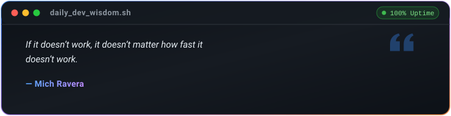

<div align="center">

  <!-- Dynamic Animated Hero Banner -->
  

  <!-- Animated Typing Subheading -->
  <a href="https://git.io/typing-svg">
    
  </a>

  <br/>

  <!-- Social Connect & Quick Badges -->
  <p align="center">
    <a href="https://gabinroy.vercel.app" target="_blank">
      
    </a>
    <a href="https://www.linkedin.com/in/gabinroy/" target="_blank">
      
    </a>
    <a href="https://twitter.com/Godwin_Abin" target="_blank">
      
    </a>
    <a href="https://komarev.com/ghpvc/?username=gabinroy&label=PROFILE+VIEWS&style=for-the-badge&color=0e7490&base=250">
      
    </a>
  </p>

</div>

---

### 💫 About Me

```yaml
name: G Abin Roy
location: India 📍
education: B.Tech in CSE (Class of 2026) from STIST (stisttvm.edu.in) 🎓
role: Freelance Full-Stack Developer 💻
portfolio: https://gabinroy.vercel.app 🌐
interests: Modern Web Development, Cloud Computing & AI Integrations 🌐
collaborating_on: Open-source projects & innovative web/mobile apps 🤝
ask_me_about: React, Next.js, Node.js, Cloud Architectures & UI/UX 💬
motto: "Clean code, scalable systems, and exceptional user experiences." 🚀
```

<br/>

---

### 💻 Tech Arsenal

<div align="center">

| Domain | Technologies & Frameworks |
| :--- | :--- |
| **Languages** |  |
| **Frontend & Mobile** |  |
| **Backend & Databases** |  |
| **Cloud & DevOps** |  |
| **Creative & AI Tools** |  |

</div>

<br/>

---

### 📊 GitHub Activity & Statistics

<div align="center">

  <!-- Summary Cards & Streak (High Uptime & Modern Dark Tokyo Night Palette) -->
  <a href="https://github.com/gabinroy">
    
  </a>
  <a href="https://github.com/gabinroy">
    
  </a>

  <br/><br/>

  <!-- Language Breakdown Cards -->
  <a href="https://github.com/gabinroy">
    
  </a>
  <a href="https://github.com/gabinroy">
    
  </a>

</div>

<br/>

---

### 🐍 Contribution Journey

<div align="center">

  <!-- Contribution Grid Snake (100% Uptime - Automated with GitHub Actions) -->
  <picture>
    <source media="(prefers-color-scheme: dark)" srcset="./assets/github-contribution-grid-snake-dark.svg">
    <source media="(prefers-color-scheme: light)" srcset="./assets/github-contribution-grid-snake.svg">
    
  </picture>

</div>

<br/>

---

### 💡 Daily Dev Wisdom

<div align="center">

  <!-- 100% Offline-Proof Self-Hosted Dev Quote (Updated automatically via GitHub Actions) -->
  <a href="https://github.com/gabinroy/gabinroy">
    
  </a>

</div>

<br/>

---

<div align="center">

  <!-- Personal Banner -->
  

  <br/><br/>

  <!-- Footer Waving Capsule -->
  

  <p>
    ⚡ <i>Crafted with precision by <b><a href="https://github.com/gabinroy">G Abin Roy</a></b> &bull; Automated with GitHub Actions</i> ⚡
  </p>

</div>
